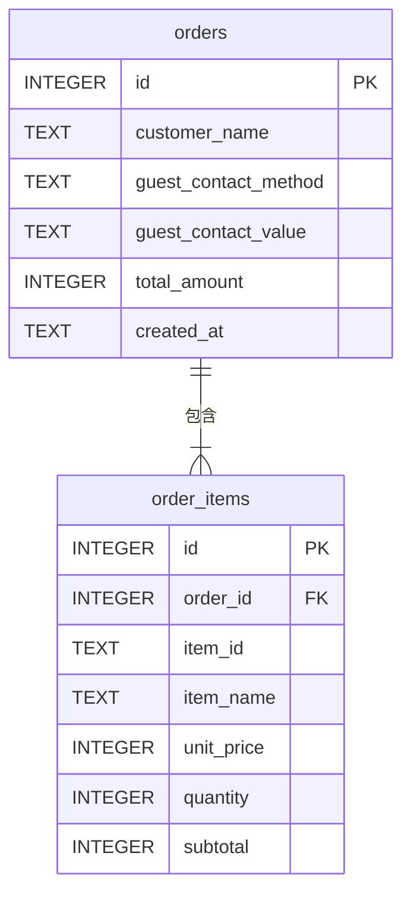

# SQLite／PostgreSQL 訂單資料庫規格

## 1. 文件目的

本機開發使用 SQLite 儲存顧客訂單。SQLite 會把資料保存在單一本機檔案中，不需要另外啟動資料庫伺服器，適合目前的本機開發與 MVP 驗證。Render 正式環境使用 PostgreSQL，避免 Web Service 重啟或重新部署時遺失團購、店家、菜單與訂單資料。

一張訂單可能包含多個餐點，因此資料拆成 `orders` 訂單主表與 `order_items` 訂單明細表。這樣可以保留訂單共同資訊，同時讓每張訂單擁有任意筆餐點明細。

## 2. 資料表關係



一筆 `orders` 至少對應一筆 `order_items`。後端會在同一個資料庫交易中寫入主表與所有明細；任一筆明細寫入失敗時會回復整個交易，避免留下不完整訂單。

## 3. `orders` 訂單主表

| 欄位 | SQLite 型別 | 限制 | 用途 |
| --- | --- | --- | --- |
| `id` | INTEGER | 主鍵、自動編號 | 訂單的唯一識別碼。 |
| `customer_name` | TEXT | 必填、去除空白後不可為空 | 顧客姓名。 |
| `guest_contact_method` | TEXT | 選填，僅允許 `phone` 或 `email` | 未登入訪客的聯絡方式類型；登入訂單及舊訂單為 `NULL`。 |
| `guest_contact_value` | TEXT | 選填，必須與類型成對 | 正規化後的訪客手機或 Email；只供私人管理與 Excel 使用。 |
| `total_amount` | INTEGER | 必填、大於或等於 0 | 訂單總金額，單位為新臺幣元。 |
| `created_at` | TEXT | 必填 | 使用包含時區的 ISO 8601 文字保存建立時間。 |

## 4. `order_items` 訂單明細表

| 欄位 | SQLite 型別 | 限制 | 用途 |
| --- | --- | --- | --- |
| `id` | INTEGER | 主鍵、自動編號 | 明細的唯一識別碼。 |
| `order_id` | INTEGER | 必填、外鍵 | 對應 `orders.id`。 |
| `item_id` | TEXT | 必填、不可空白 | 送單當下的菜單餐點識別碼。 |
| `item_name` | TEXT | 必填、不可空白 | 送單當下的餐點名稱。 |
| `unit_price` | INTEGER | 必填、大於或等於 0 | 送單當下的單價。 |
| `quantity` | INTEGER | 必填、大於 0 | 購買數量。 |
| `note` | TEXT | 必填、預設空字串、最多 200 字 | 該餐點的選填自由文字備註。 |
| `subtotal` | INTEGER | 必填、等於單價乘以數量 | 此餐點的小計。 |

即使日後菜單名稱或價格改變，訂單明細仍保留送單當下的名稱、價格與備註，讓歷史訂單內容不會跟著改變。

登入訂單的可信任身分來自 `orders.user_id` 關聯的 `app_users`；訪客才使用 `guest_contact_method` 與 `guest_contact_value`。舊訂單兩個欄位皆為 `NULL`，系統以「舊訂單（未記錄）」呈現，不自動猜測或回填。聯絡資料不得出現在公開菜單或分享 API，也不得寫入 log。

## 5. 關聯與索引

- `order_items.order_id` 參照 `orders.id`。
- SQLite 連線會啟用外鍵限制，避免明細連到不存在的訂單。
- 刪除訂單主表資料時，其明細會透過 `ON DELETE CASCADE` 一併刪除。
- `orders.created_at` 有索引，供後續管理後台依建立時間查詢。
- `order_items.order_id` 有索引，供後續快速取得一張訂單的全部明細。

## 6. 初始化方式

資料庫位置預設讀取環境變數 `DATABASE_URL`；未設定時使用與 `.env.example` 相同的安全本機值：

```text
sqlite:///./app.db
```

在專案根目錄執行：

```powershell
& "C:\Users\sharo\anaconda3\python.exe" -m backend.database
```

指令會建立 `app.db`、資料表與必要索引。初始化可重複執行；舊資料庫只新增可為 `NULL` 的訪客聯絡欄位，不會刪除或改寫既有資料。`*.db` 已被 `.gitignore` 排除，不會提交至 Git。

## 7. Render PostgreSQL

正式環境將 Render PostgreSQL 的 Internal Database URL 設為 Web Service 的 `DATABASE_URL`。後端在服務啟動時以可重複執行的 `CREATE TABLE IF NOT EXISTS` 建立空資料庫所需資料表與索引，不搬移本機測試資料，也不在 log 顯示連線字串。

既有資料函式同時支援兩種資料庫：SQLite 保留 `?` 參數、外鍵 PRAGMA 與舊資料安全升級；PostgreSQL 透過 Psycopg 使用 `%s` 參數、`BIGSERIAL` 主鍵及送單流水號列鎖。兩種模式都維持單一交易寫入訂單主表與全部明細。

## 8. 本階段限制

- 已可透過 `GET /api/admin/orders` 讀取訂單及完整明細，並由 `/admin` 簡易管理後台顯示。
- PostgreSQL 從全新空資料庫開始，不自動搬移本機 SQLite 測試資料。
